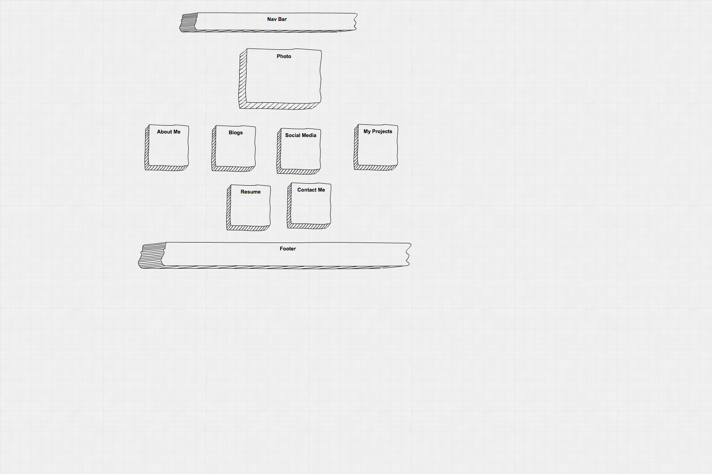
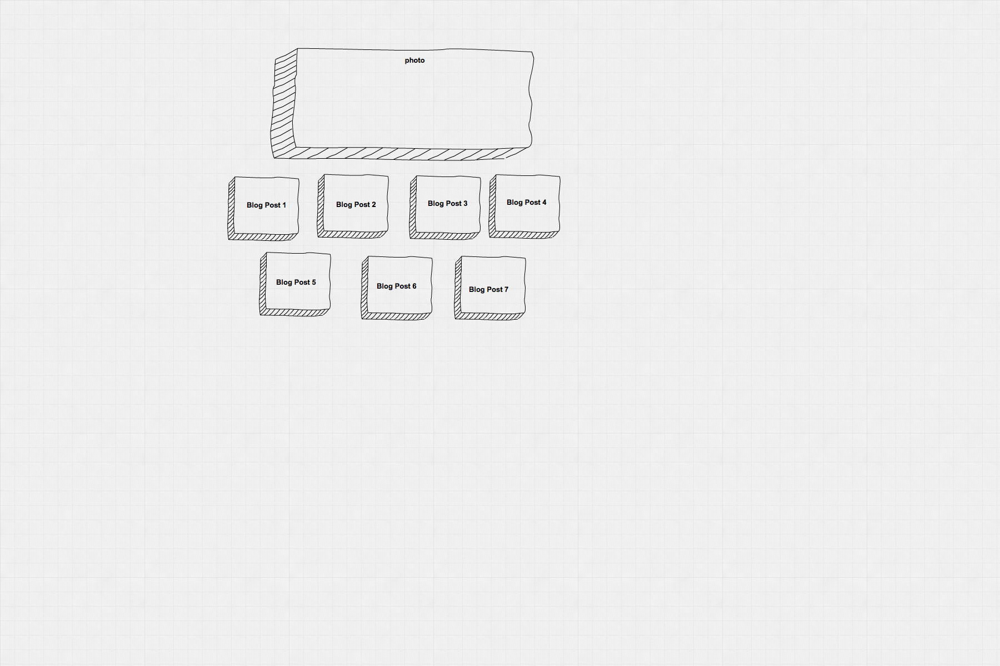

What is a wireframe?  What are the benefits of wireframing?

Wireframe is a blueprint or layout that allows us to plan how we want our page to look without the distractions of color and fonts.  Wireframe allows designers to focus on making the layout easy to navigate for the intended user.

Did you enjoy wireframing your site?

It was interesting to learn about wireframing and the different tools tha tcould be used.

Did you revise your wireframe or stick with your first idea?

I stuck with my first idea. It was simple and for the purpose of learning, I thought simple would be best for now.

What questions did you ask during this challenge? What resources did you find to help you answer them?

I asked what is wireframe and why bother during this challenge. Using the Simple Diagram too to make the wireframe made me realize that I am able to clearly visualize how my page will look like without distractions of formatting.

Which parts of the challenge did you enjoy and which parts did you find tedious?

I enjoyed creating the wireframes, what I found tedious was the git part, but it is good practice of git.