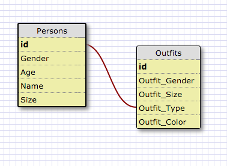

RELEASE 5:

1. SELECT * FROM states;

2. SELECT * FROM regions;

3. SELECT state_name, populaton FROM states;

4. SELECT state_name, population FROM states ORDER BY population DESC;

5. SELECT state_name FROM states WHERE region = 7;

6. SELECT state_name, population_density FROM states WHERE population_density > 50;

7. SELECT state_name FROM states WHERE population BETWEEN 1000000 AND 1500000;

8. SELECT state_name, region_id FROM states ORDER BY region_id ASC;

9. SELECT region_name FROM regions WHERE region_name = '%central%';

10. SELECT region_name, state_name FROM regions, states ORDER BY region_id ASC;

one-to-many Relationship;

REFLECTION;

What are databases for?;

Databases are for storing data and accessing data/information.  There are tons of data out there and databases could store them, organize them, and access only the ones that we need.  For example we can store information about a person, based on name, age, and gender.  Then later pull that information up.

What is a one-to-many relationship?;

A one-to-many relationship means that one thing or piece of data is related to many pieces of data.  Such as a gym has a one to many relationship with it's customers.  There is only gym and there are many customers.

What is a primary key? What is a foreign key? How can you determine which is which?;

A primary key is a unique peice of infomation.  A great example of this is your social security number.  Only one person may have such a unique number.  A foreign key is similar but in another table.  So the table where the foriegn key lies is relatied to the table where the primary key.  The foreign key is also unique to its table.  You can determine it is a primary key because it extremely unique and the foreign key is only unique to its table but relatable to the primary key's table.  So for example a student's records, with a primary key of social security number and grades being a new table with a foreign key of student id# linking the table to the student records table.

How can you select information out of a SQL database? What are some general guidelines for that?;

Using the SELECT syntax allows you to select an attribute from a table and using the FROM syntax allows you to chose the able where you are accessing the data from.  The * signifies all attributes, so if you input SELECT *, you are selecting all attrubites from the table.
