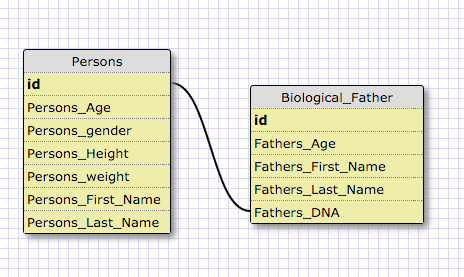
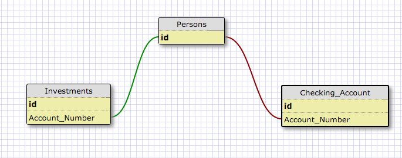
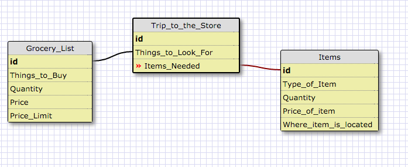

##one-to-one Relationship

##one-to-many Relationship

##many-to-many Relationship

##What is a one-to-one database?

A one-to-one relationship is a single relationship to another.  An example would be that a person can only have one biological father. We are only looking at the relationship of the person to the father. But if were to look at the relationship a father may have more than one child, that would be a one-to-many relationship.

##When would you use a one-to-one database? (Think generally, not in terms of the example you created).

When you have a child-parent relationship. When looking at databases, there will always be a parent for each child. Or each state only and one capital.

##What is a many-to-many database?

A many-to-many database is when there are many things that may be related by many things.  For example a there are many gym members who may attend many gyms owned by 24 hour fitness and there are many employees employeed by the gym.

##When would you use a many-to-many database? (Think generally, not in terms of the example you created).

When there is a correlation between many tables to one and one to many other tables.  Such as many students taking a particular subject in college and there are many teachers who teaches the subject.

##What is confusing about database schemas? What makes sense?

For the most part, it all makes sense.  Although it can become confusing when trying to explain the relationships to others.  One-to-one relationships can be difficult to find examples of.